```mermaid
graph TD
    classDef service fill:#f9f,stroke:#333,stroke-width:2px
    classDef interface fill:#ff9,stroke:#333,stroke-width:2px
    classDef external fill:#9ff,stroke:#333,stroke-width:2px
    classDef component fill:#fff,stroke:#333,stroke-width:2px
    classDef mediator fill:#ffd,stroke:#333,stroke-width:2px
    classDef command fill:#ffe,stroke:#333,stroke-width:2px

    %% API слой
    subgraph "API слой"
        API[KafkaRedis.Api]
    end

    %% Доменный слой
    subgraph "Доменный слой"
        subgraph "Интерфейсы"
            IKP[IKafkaProducer]
            IKC[IKafkaConsumer]
            IRS[IRedisService]
            IMS[IMessageSend]
            ICF[IKafkaConsumerFactory]
            ILS[ILoggingService]
        end

        subgraph "Модели"
            KS[KafkaSettings]
            RS_SET[RedisSettings]
            SS[SeqSettings]
        end

        subgraph "Команды"
            PMC[ProduceMessageCommand]
            CMC[ConsumeMessageCommand]
        end
    end

    %% Инфраструктурный слой
    subgraph "Инфраструктурный слой"
        subgraph "Сервисы"
            KP[KafkaProducerService]
            KC[KafkaConsumerService]
            RS[RedisService]
            MS[MessageSend]
            CF[KafkaConsumerFactory]
            Timer[MessageTimerService]
            LS[LoggingService]
        end

        subgraph "Обработчики"
            PMH[ProduceMessageHandler]
            CMH[ConsumeMessageHandler]
        end

        MediatR[MediatR]
    end

    %% Внешние сервисы
    subgraph "Внешние сервисы"
        Kafka[Apache Kafka]
        Redis[(Redis)]
        KafkaUI[Kafka UI]
        RedisCommander[Redis Commander]
        Seq[Seq]
    end

    %% Реализация сервисов
    KP -.implements.-> IKP
    KC -.implements.-> IKC
    RS -.implements.-> IRS
    MS -.implements.-> IMS
    CF -.implements.-> ICF
    LS -.implements.-> ILS

    %% Зависимости сервисов
    KP -.uses.-> KS
    KC -.uses.-> KS
    RS -.uses.-> RS_SET
    KC -.uses.-> CF
    LS -.uses.-> SS

    %% Поток сообщений
    Timer --triggers--> MS
    MS --sends--> MediatR
    MediatR --handles--> PMH
    PMH --uses--> KP
    PMH --uses--> RS
    PMH --sends--> CMC
    
    %% Внешние подключения
    KP --produces--> Kafka
    KC --consumes--> Kafka
    RS --caches--> Redis
    LS --logs--> Seq

    %% Зависимости API
    API --> MediatR
    
    %% Паттерн Медиатор
    PMH -.handles.-> PMC
    CMH -.handles.-> CMC

    %% Применение стилей
    class KP,KC,RS,MS,CF,Timer service
    class IKP,IKC,IRS,IMS,ICF,ILS interface
    class Kafka,Redis,KafkaUI,RedisCommander,Seq external
    class API component
    class MediatR mediator
    class PMC,CMC command
```

## Условные обозначения

- 🟦 Синий - Внешние сервисы (Kafka, Redis)
- 🟪 Розовый - Сервисы (KafkaProducer, RedisService и др.)
- 🟨 Желтый - Интерфейсы (IKafkaProducer, IRedisService и др.)
- ⬜ Белый - API слой
- 🟫 Коричневый - Медиатор
- 🟨 Светло-желтый - Команды

## Архитектурные слои

### API слой
- Точка входа в приложение
- Минимальная логика, только маршрутизация запросов через MediatR

### Доменный слой
- Интерфейсы сервисов
- Модели конфигурации
- Команды MediatR
- Не содержит реализации бизнес-логики

### Инфраструктурный слой
- Реализации сервисов
- Обработчики команд
- Интеграция с внешними сервисами
- Фоновые задачи (MessageTimerService)

### Ключевые компоненты

#### MessageTimerService
- Фоновая служба
- Периодически отправляет тестовые сообщения
- Использует MessageSend для доставки

#### MessageSend
- Абстракция отправки сообщений
- Использует MediatR для отправки команд

#### ProduceMessageHandler
- Обрабатывает ProduceMessageCommand
- Отправляет сообщение в Kafka
- Сохраняет сообщение в Redis
- Инициирует получение сообщения

#### KafkaConsumerFactory
- Создает потребителей Kafka
- Управляет жизненным циклом потребителей

## Инфраструктура логирования

Приложение использует Serilog для структурированного логирования с интеграцией Seq. Инфраструктура логирования настроена в следующих компонентах:

### Компоненты

#### LoggingService
- Расположен в `KafkaRedis.Infrastructure.Services`
- Реализует интерфейс `ILoggingService`
- Настраивает глобальный логгер Serilog с интеграцией Seq
- Читает конфигурацию из appsettings.json
- Выводит логи в консоль и сервер Seq

#### LoggingExtensions
- Расположен в `KafkaRedis.Infrastructure.Extensions`
- Предоставляет методы расширения для настройки DI и middleware
- `AddLoggingServices`: Настраивает сервисы логирования в DI контейнере
- `UseLoggingMiddleware`: Настраивает логирование HTTP-запросов с обогащенным контекстом

#### SeqSettings
- Расположен в `KafkaRedis.Domain.Models`
- Содержит конфигурацию сервера Seq
- Настраивается через appsettings.json

### Конфигурация
Логирование настраивается через appsettings.json и включает:
- URL сервера Seq
- Уровни логирования
- Вывод в консоль
- Обогащение контекста запросов

## Паттерны проектирования
- CQRS (через MediatR)
- Медиатор (MediatR для обработки команд)
- Фабрика (KafkaConsumerFactory)
- Репозиторий (RedisService)
- Фоновая служба (MessageTimerService)
